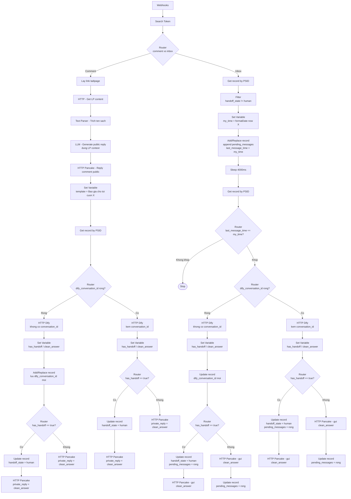

# Make Flow - CSKH Bot

## Luồng tổng thể



---

## Cấu hình từng node

### Filter — chặn handoff (HG)

| Setting | Giá trị |
|---|---|
| Condition | `{{IG.handoff_state}}` not equal `human` |

Nếu fail → bundle bị drop, scenario dừng. Xử lý được cả `null` (khách mới) vì `null ≠ "human"` → pass.

---

### Set Variable — my_time (P)

| Variable | Giá trị |
|---|---|
| `my_time` | `{{formatDate(now; "X")}}` |

---

### Add/Replace record — debounce (IAR)

Overwrite: **Yes**

| Field | Giá trị |
|---|---|
| psid | từ webhook |
| dify_conversation_id | `{{IG.dify_conversation_id}}` |
| handoff_state | `{{ifempty(IG.handoff_state; "bot")}}` |
| pending_messages | `{{trim(IG.pending_messages)}}{{if(trim(IG.pending_messages); newline; "")}}{{stripTags(webhook.message)}}` |
| last_message_time | `{{my_time}}` |

> `ifempty(...; "bot")` xử lý trường hợp record chưa tồn tại — tránh lưu null vào handoff_state.

---

### Router — last_message_time == my_time? (S)

| Route | Condition | Làm gì |
|---|---|---|
| Khop | `{{R.last_message_time}}` equals `{{my_time}}` | Tiếp tục → gọi Dify |
| Khong khop | else | Stop |

---

### Router — dify_conversation_id rong? (CL, U)

| Route | Condition | Làm gì |
|---|---|---|
| Rong | `{{Get_record.dify_conversation_id}}` is empty | Gọi Dify không có conversation_id |
| Co | else | Gọi Dify kèm conversation_id |

---

### Set Variable — parse Dify response (CPV1, CPV2, IPV1, IPV2)

Đặt ngay sau mỗi HTTP Dify. HTTP module bật **Parse response: Yes**.

| Variable | Giá trị |
|---|---|
| `has_handoff` | `{{if(contains(HTTP_Dify.data.answer; "##HANDOFF:"); true; false)}}` |
| `clean_answer` | `{{trim(replace(HTTP_Dify.data.answer; /##HANDOFF:[A-Z_]+##/; ""))}}` |

---

### Add/Replace record — lưu dify_conversation_id mới (CAR, comment Rong)

Overwrite: **Yes**

| Field | Giá trị |
|---|---|
| psid | từ webhook |
| dify_conversation_id | `{{CL1.data.conversation_id}}` |
| handoff_state | `{{ifempty(CG.handoff_state; "bot")}}` |
| pending_messages | `{{CG.pending_messages}}` |
| last_message_time | `{{CG.last_message_time}}` |

> Add/Replace vì record có thể chưa tồn tại (khách comment lần đầu). Map lại tất cả fields để tránh mất dữ liệu inbox.

---

### Update record — lưu dify_conversation_id mới (ISAVE1, inbox Rong)

| Field | Giá trị |
|---|---|
| psid | từ webhook *(key)* |
| dify_conversation_id | `{{V.data.conversation_id}}` |

> Update được vì IAR đã tạo record trước đó.

---

### Router — has_handoff == true? (CCHO1, CCHO2, IHO1, IHO2)

| Route | Condition | Làm gì |
|---|---|---|
| Co handoff | `{{has_handoff}}` equals `true` | Xử lý handoff |
| Khong | else | Gửi Pancake, xoá pending |

---

### Update record — set handoff_state = human (CCHS1, CCHS2, IHS1, IHS2)

| Field | Giá trị |
|---|---|
| psid | từ webhook *(key)* |
| handoff_state | `human` |
| pending_messages | *(để trống)* |

---

### Update record — xoá pending_messages (ICLR1, ICLR2)

| Field | Giá trị |
|---|---|
| psid | từ webhook *(key)* |
| pending_messages | *(để trống)* |

---

## Data Store Schema

```json
{
  "psid": "string",
  "dify_conversation_id": "string",
  "handoff_state": "bot",
  "pending_messages": "",
  "last_message_time": 0
}
```

---

## Ghi chú

- **Get record — if not found: Continue**: checkbox trong Make module setting — trả về null thay vì Stop; flow chạy bình thường, record được tạo bởi Add/Replace phía sau
- **ifempty(handoff_state; "bot")**: tránh lưu null khi record mới tạo lần đầu
- **HTTP Parse response: Yes**: không cần node JSON Parse riêng — truy cập thẳng `HTTP_Dify.data.answer`, `HTTP_Dify.data.conversation_id`
- **Set Variable sau HTTP Dify**: tập trung detect + strip `##HANDOFF:REASON##` tại 1 chỗ — Router và Pancake chỉ đọc `has_handoff` và `clean_answer`
- **clean_answer luôn dùng được**: nếu không có tag, `replace()` trả về text gốc — cả 2 nhánh Router gửi `clean_answer` cho Pancake
- **Add/Replace vs Update**: Add/Replace cho record có thể chưa tồn tại (CAR, IAR); Update cho record chắc chắn đã tồn tại (ISAVE1, IHS, ICLR, CCHS)
- **ISAVE1**: lưu dify_conversation_id mới trước Router handoff — đảm bảo conversation_id được lưu bất kể handoff hay không
- **Debounce 4000ms**: gom tin nhắn liên tiếp thành 1 request Dify
- **Race condition**: chấp nhận rủi ro thấp khi 2 tin nhắn đến trong vài chục ms — Make Data Store không hỗ trợ atomic append
- **Human handoff signal**: Dify append `##HANDOFF:REASON##` vào cuối response (CONFIRM / COMPLAINT / FALLBACK / KB_MISS / FAQ_MISS / HUMAN_REQUEST) — Make detect bằng `contains "##HANDOFF:"`, strip bằng regex `/##HANDOFF:[A-Z_]+##/`, gửi `clean_answer` cho khách
- **handoff_state check**: dùng Filter thay vì Router — chỉ cần gate "đi tiếp hoặc dừng", không có nhánh thứ 2; null cũng pass vì null ≠ "human"
- **Các trường hợp handoff từ Dify**: CONFIRM (luôn), COMPLAINT (luôn), FALLBACK (luôn), INQUIRY khi KB rỗng, FAQ khi câu hỏi ngoài bảng, HUMAN_REQUEST (khách xin gặp nhân viên)
