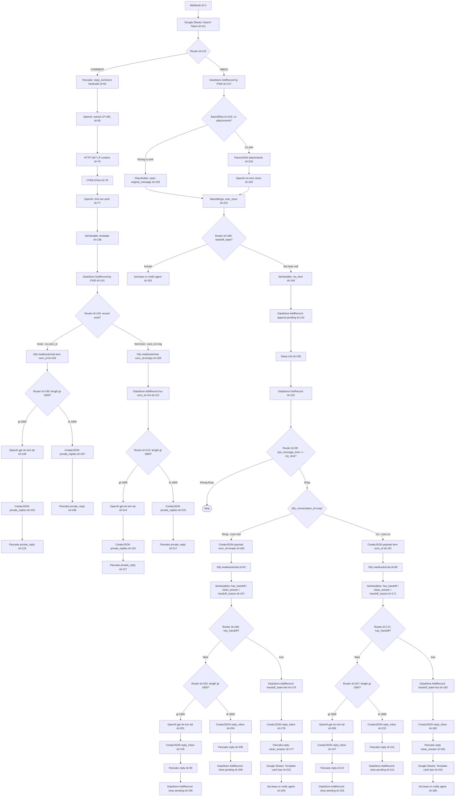

# Make Flow - CSKH Bot

> **Nguồn xác thực:** Tài liệu này reflect trực tiếp từ `make/scenario.json`.

## Luồng tổng thể



---

## Cấu hình từng node

### id=111 — Google Sheets: Search Token

Lookup `page_access_token` theo `page_id` từ sheet `Page access Token`.

- Output: `111.\`1\`` = page_id, `111.\`2\`` = page_access_token

---

### id=115 — Router: COMMENT vs INBOX

| Route | Condition |
|---|---|
| COMMENT | `{{1.data.conversation.type}}` equals `COMMENT` |
| INBOX | else |

---

## COMMENT FLOW

### id=62 — Pancake: reply_comment hardcode

Gửi **ngay lập tức** khi nhận comment, trước khi xử lý AI.

```json
{
  "action": "reply_comment",
  "message": "a//c check inbox giúp em",
  "sender_id": "b9167563-b868-4f17-a408-ac992caa8f2b",
  "message_id": "{{1.data.message.id}}"
}
```

URL: `POST https://pages.fm/api/public_api/v1/pages/{{1.page_id}}/conversations/{{1.data.conversation.id}}/messages?page_access_token={{111.\`2\`}}`

---

### id=65 — OpenAI: extract LP URL

Model: `gpt-5.3-chat-latest` | Format: `json_object`

Input: `1.data.post.message` (nội dung bài đăng FB)

Prompt: Tìm URL landing page trong nội dung post. Output: `{"link": "https://..."}` hoặc `{"link": ""}`.

Output: `65.result.link`

---

### id=76 — HTTP GET LP content

`GET {{65.result.link}}`

---

### id=79 — HTMLToText

Strip HTML từ `76.data` → plain text.

---

### id=77 — OpenAI: trích tên sách

Model: `gpt-5.3-chat-latest` | Format: `text`

Input: LP text từ `79.text`

Prompt: Trích tên sách hoặc chủ đề ngắn gọn từ nội dung LP. Output 1 câu, không kèm giá/combo.

Output: `77.result`

---

### id=138 — SetVariable: template

| Variable | Giá trị |
|---|---|
| `template` | `Báo giá cho tôi cuốn sách {{77.result}}` |

---

### id=141 — DataStore GetRecord (comment)

Key: `{{1.data.message.from.id}}` (PSID)

If not found: **Continue** (trả null, không stop).

---

### id=145 — Router: record exist?

| Route | Condition |
|---|---|
| Exist | `{{141}}` exist |
| Not Exist | `{{141}}` notexist |

---

### id=105 / id=109 — Dify (comment)

URL: `POST https://dify.weupbook.com/webhook/nkbCkXwlTk3v91LD/chat`

```json
{
  "message": "{{138.template}}",
  "user_id": "{{1.data.conversation.from.id}}",
  "conversation_id": "{{141.dify_conversation_id}}",
  "inputs": { "comment_context": "", "lp_content": "" }
}
```

- **id=105** (exist): kèm `141.dify_conversation_id`
- **id=109** (notexist): `conversation_id: ""`

---

### id=112 — DataStore AddRecord (comment, conv mới)

Lưu sau khi Dify trả conversation_id mới (id=109).

| Field | Giá trị |
|---|---|
| key | `{{1.data.conversation.from.id}}` |
| handoff_state | `bot` |
| pending_messages | *(rỗng)* |
| last_message_time | *(rỗng)* |
| dify_conversation_id | `{{109.data.conversation_id}}` |
| pancake_conversation_id | `{{1.data.conversation.id}}` |

---

### id=195 / id=213 — Router: response > 1900 chars?

| Route | Condition |
|---|---|
| >1900 | `length(answer)` greater than `1900` |
| ≤1900 | else |

---

### id=199 / id=214 — OpenAI gpt-4o: tóm tắt

Prompt: Tóm tắt câu trả lời khách hàng, không vượt quá **1500 ký tự**, giữ nội dung đầy đủ.

Input: `{{105.data.answer}}` hoặc `{{109.data.answer}}`

---

### id=132 / id=197 / id=116 / id=216 — CreateJSON: private_replies

```json
{
  "action": "private_replies",
  "message": "<answer hoặc summary>",
  "post_id": "{{1.data.post.id}}",
  "sender_id": "b9167563-b868-4f17-a408-ac992caa8f2b",
  "message_id": "{{1.data.message.id}}"
}
```

---

## INBOX FLOW

### id=147 — DataStore GetRecord (inbox)

Key: `{{1.data.conversation.from.id}}` (PSID)

If not found: **Continue**.

---

### id=224 — BasicIfElse: có ảnh không?

| Branch | Condition | Flow |
|---|---|---|
| condition (branch 0) | `{{1.data.message.attachments[]}}` notexist | → id=229 (Placeholder) |
| else (branch 1) | attachments tồn tại | → id=226 → id=225 |

Cả 2 nhánh đều `merge: true` → hội tụ tại id=231.

---

### id=226 — ParseJSON attachments

Parse `{{1.data.message.attachments[]}}` → lấy `url` của ảnh.

---

### id=225 — OpenAI o4-mini vision

Model: `o4-mini` | Format: `json_object`

Input: ảnh từ `{{226.url}}`

Prompt: Quan sát ảnh khách gửi → suy luận khách muốn nhắn gì → tạo **1 câu tự nhiên** như khách hàng thật (ví dụ: tên sách nếu thấy rõ, lời khiếu nại nếu có...).

Output: `225.result`

---

### id=229 — Placeholder (no-image path)

Không làm gì, chỉ pass `1.data.message.original_message` qua BasicMerge.

---

### id=231 — BasicMerge

Hội tụ 2 nhánh. Output:

| `user_input` | Nguồn |
|---|---|
| text path | `{{1.data.message.original_message}}` |
| image path | `{{225.result}}` |

---

### id=189 — Router: handoff_state?

| Route | Condition | Action |
|---|---|---|
| `handoff_state == bot` | `{{147.handoff_state}}` equals `bot` | Tiếp tục debounce |
| `handoff_state == human` | `{{147.handoff_state}}` equals `human` | Notify agent → stop |

> `null` (khách mới) **không match** cả 2 → flow dừng. Record tạo lần đầu ở bước AddRecord (id=142) với `handoff_state = ifempty(...; "bot")`.

---

### id=191 — bot.base.vn: entry human notify

Khi khách đang ở trạng thái `human` (đã được handoff trước đó):

```
POST https://bot.base.vn/v1/webhook/send/{token}
Content-Type: application/x-www-form-urlencoded

bot_username=CSKHBOT
bot_name=cskh cảnh báo
content=Khách hàng cần hỗ trợ trực tiếp tại: https://pancake.vn/{page_id}?c_id={page_id}_{psid}
```

---

### id=148 — SetVariable: my_time

| Variable | Giá trị |
|---|---|
| `my_time` | `{{formatDate(now; "X")}}` (Unix timestamp, giây) |

---

### id=142 — DataStore AddRecord: debounce append

Overwrite: **Yes**

| Field | Giá trị |
|---|---|
| key | `{{1.data.message.from.id}}` |
| handoff_state | `{{ifempty(147.handoff_state; "bot")}}` |
| pending_messages | `{{147.pending_messages}}{{if(147.pending_messages; newline; )}}{{231.user_input}}` |
| last_message_time | `{{148.my_time}}` |
| dify_conversation_id | `{{147.dify_conversation_id}}` |
| pancake_conversation_id | `{{1.data.conversation.id}}` |

> `ifempty(...; "bot")`: tránh lưu null khi khách nhắn lần đầu.
> pending append dùng `231.user_input` (merged text/image), không phải raw message.

---

### id=150 — Sleep

**10 giây** (duration: 10). Debounce window để gom tin nhắn liên tiếp.

---

### id=152 — DataStore GetRecord (race check)

Đọc lại record sau sleep để kiểm tra `last_message_time`.

---

### id=29 — Router: race check

| Route | Condition | Action |
|---|---|---|
| Khớp | `{{152.last_message_time}}` equals `{{148.my_time}}` (text:equal) | Tiếp tục → gọi Dify |
| Không khớp | else | Stop — có tin nhắn mới hơn đã ghi đè `last_message_time` |

> So sánh **text:equal** (string), không phải number.

---

### id=29 → Router: dify_conversation_id rỗng?

| Route | Condition |
|---|---|
| Rỗng | `{{152.dify_conversation_id}}` notexist |
| Có | `{{152.dify_conversation_id}}` exist |

---

### id=160 / id=161 — CreateJSON: Dify payload

**id=160** (conv mới):
```json
{
  "inputs": { "lp_content": "", "comment_context": "" },
  "message": "{{152.pending_messages}}",
  "user_id": "{{1.data.conversation.from.id}}",
  "conversation_id": ""
}
```

**id=161** (conv cũ):
```json
{
  "inputs": { "lp_content": "", "comment_context": "" },
  "message": "{{152.pending_messages}}",
  "user_id": "{{1.data.conversation.from.id}}",
  "conversation_id": "{{152.dify_conversation_id}}"
}
```

---

### id=91 / id=89 — Dify (inbox)

URL: `POST https://dify.weupbook.com/webhook/nkbCkXwlTk3v91LD/chat`

Timeout: **300s** (5 phút). Parse response: Yes.

- **id=91**: gửi payload từ id=160 (conv mới)
- **id=89**: gửi payload từ id=161 (conv cũ)

---

### id=167 / id=171 — SetVariables: parse Dify response

| Variable | Giá trị |
|---|---|
| `has_handoff` | `{{if(contains(answer; "##HANDOFF:"); true; false)}}` |
| `clean_answer` | `{{trim(get(split(answer; "##HANDOFF:"); 1))}}` — phần **TRƯỚC** `##HANDOFF:` |
| `handoff_reason` | `{{get(split(get(split(answer; "##HANDOFF:"); 2); "##"); 1)}}` — ví dụ `CONFIRM` |

> `clean_answer` = split lấy phần đầu (index 1 = trước delimiter), **không** dùng regex replace.

---

### id=168 / id=172 — Router: has_handoff?

| Route | Condition | Action |
|---|---|---|
| false | `{{has_handoff}}` equals `false` | → Router truncate → Pancake reply → clear pending |
| true | `{{has_handoff}}` equals `true` | → AddRecord (bot) → Pancake reply → notify agent |

---

### id=202 / id=207 — Router: response > 1900 chars? (no-handoff path)

| Route | Condition |
|---|---|
| >1900 | `length(clean_answer)` greater than `1900` |
| ≤1900 | else |

---

### id=201 / id=209 — OpenAI gpt-4o: tóm tắt (inbox)

Giống comment flow: tóm tắt `clean_answer` về ≤ 1500 ký tự.

---

### id=135 / id=137 — CreateJSON: reply_inbox

```json
{
  "action": "reply_inbox",
  "message": "<summary hoặc clean_answer>",
  "sender_id": "b9167563-b868-4f17-a408-ac992caa8f2b"
}
```

---

### id=39 / id=42 / id=205 / id=211 — Pancake reply (inbox, no-handoff)

`POST https://pages.fm/api/public_api/v1/pages/{{1.page_id}}/conversations/{{1.data.conversation.id}}/messages?page_access_token={{111.\`2\`}}`

Body: JSON từ CreateJSON phía trên.

---

### id=156 / id=155 / id=206 / id=212 — DataStore AddRecord: clear pending

| Field | Giá trị |
|---|---|
| key | PSID |
| handoff_state | `{{ifempty(147.handoff_state; "bot")}}` |
| pending_messages | *(rỗng)* |
| last_message_time | `{{148.my_time}}` |
| dify_conversation_id | `{{91.data.conversation_id}}` hoặc `{{89.data.conversation_id}}` |
| pancake_conversation_id | `{{1.data.conversation.id}}` |

---

### id=176 / id=180 — DataStore AddRecord: handoff save

Khi `has_handoff == true`. **handoff_state lưu là `"bot"`** (bot vẫn active).

| Field | Giá trị |
|---|---|
| key | PSID |
| handoff_state | `bot` |
| pending_messages | *(rỗng)* |
| last_message_time | `{{148.my_time}}` |
| dify_conversation_id | `{{91.data.conversation_id}}` |
| pancake_conversation_id | `{{1.data.conversation.id}}` |

---

### id=178 / id=182 — CreateJSON: handoff reply

```json
{
  "action": "reply_inbox",
  "message": "{{167.clean_answer}}",
  "sender_id": "b9167563-b868-4f17-a408-ac992caa8f2b"
}
```

---

### id=177 / id=181 — Pancake reply (handoff path)

Gửi `clean_answer` cho khách trước khi notify agent.

---

### id=222 / id=223 — Google Sheets: Template cảnh báo

Spreadsheet ID: `1F8rjc91PaJzHL8F7Nf0NJhUlV2Uyvwb1uqj46qC481g`

Sheet: `Template cảnh báo`

Filter: cột A equals `{{167.handoff_reason}}` (hoặc `171.handoff_reason`)

Output: `222.\`1\`` = template text tương ứng với reason.

---

### id=183 / id=185 — bot.base.vn: handoff notify

```
POST https://bot.base.vn/v1/webhook/send/{token}
Content-Type: application/x-www-form-urlencoded

bot_username=CSKHBOT
bot_name=cskh cảnh báo
content=[{handoff_reason}] - {template_text}
Tin nhắn gần nhất của khách: [{152.pending_messages}]
Xem cuội hội thoại chi tiết tại đây: https://pancake.vn/{page_id}?c_id={page_id}_{psid}
```

---

## Data Store Schema

```json
{
  "key": "<PSID>",
  "handoff_state": "bot",
  "pending_messages": "",
  "last_message_time": 0,
  "dify_conversation_id": "",
  "pancake_conversation_id": ""
}
```

---

## Ghi chú tổng hợp

- **GetRecord if not found: Continue** — trả null thay vì stop; record mới được tạo ở AddRecord phía sau
- **ifempty(handoff_state; "bot")** — tránh lưu null khi record chưa tồn tại
- **Debounce = 10 giây** — Sleep id=150, duration=10
- **Race check dùng text:equal** — so sánh string, không phải số
- **user_input = 231.user_input** — output của BasicMerge (text path: `original_message`, image path: o4-mini vision result)
- **clean_answer = split lấy phần trước ##HANDOFF:** — `split(answer; "##HANDOFF:")[1]` theo index Make (1-based = phần đầu)
- **handoff_state KHÔNG set "human" sau handoff** — bot tiếp tục xử lý; agent nhận notify qua bot.base.vn
- **handoff_state == "human"** chỉ được set thủ công (admin reset); bot tự xử lý trường hợp này bằng id=191 (notify lại agent)
- **Dify endpoint**: `https://dify.weupbook.com/webhook/nkbCkXwlTk3v91LD/chat` — cả inbox lẫn comment
- **Timeout Dify = 300s** — Gemini/model chậm có thể mất vài chục giây
- **Response truncation** — chỉ áp dụng khi `has_handoff == false`; threshold 1900 ký tự → gpt-4o tóm tắt ≤ 1500
- **sender_id hardcode** = `b9167563-b868-4f17-a408-ac992caa8f2b` — page sender ID của WEUP
- **Comment flow không debounce** — gửi thẳng Dify, không gom tin
- **Comment public reply hardcode** — không dùng LLM; OpenAI chỉ dùng để extract tên sách
- **pancake_conversation_id** — lưu vào Data Store để dùng trong notify agent link
